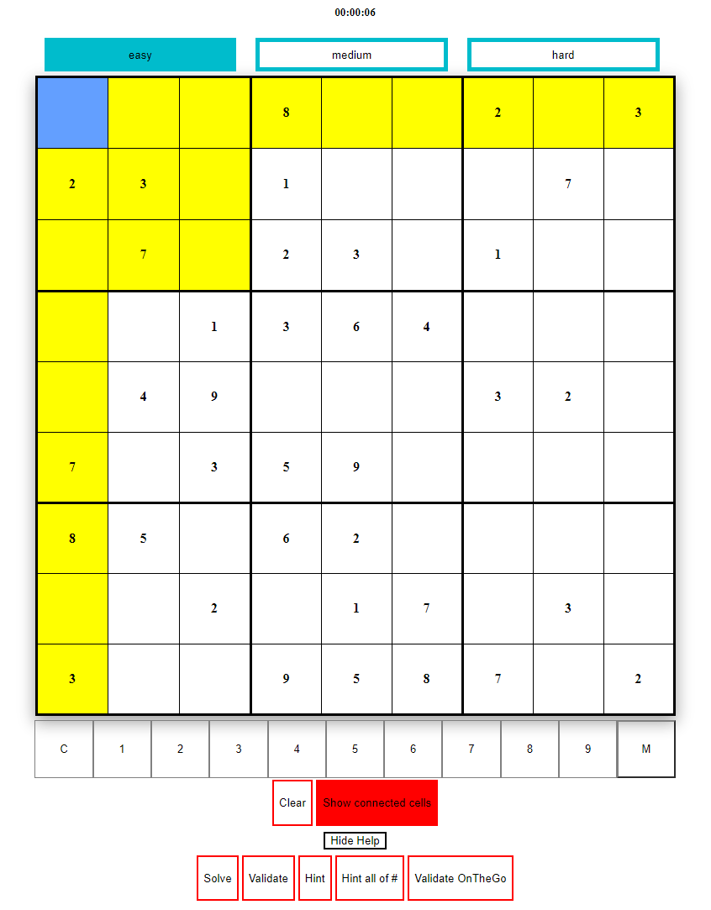

## react-sudoku-component
A Sudoku as a lightweight react-component.


## Installation
```
npm install --save react-sudoku-component
```

## Documentation
[react-sudoku-component documentation](https://sunnanv.github.io/react-sudoku-component/)